# Introduction to eikosograms

------------------------------------------------------------------------

Note that eikosograms are `grid` objects and so may be manipulated as
any other (e.g. arranging several eikosograms in the same display using
[`grid.arrange()`](https://rdrr.io/pkg/gridExtra/man/arrangeGrob.html)
from the `gridExtra` package).

``` r
library(eikosograms)
library(gridExtra)
```

## A picture of probability

The word **eikosogram** is constructed by joining two ancient Greek
words:

      *eikos*: like truth, likely, probable, reasonable, probability,
likelihood  
      *gramma*: that which is drawn, picture, piece of writing

As the name suggests, an **eikosogram** is a **picture of probability**.
It visually partitions a unit square into rectangular regions whose
areas give the numerical values of various probabilities. The
construction is such that each rectangular region is identified with the
value of one or more categorical variates.

For example, consider the probability that an application for admission
to university is accepted. Different universities and programs of study
can have different admission rates. For example, in 2017 there were
about 15,200 applications to the Faculty of Mathematics at the
University of Waterloo for only 1200 first year places, suggesting the
probability that an application is accepted is about 0.08. Suppose this
to be the case, then the eikosogram representing the application process
is given by


Application to Waterloo’s Faculty of Mathematics (2017)

Only two decisions are possible – an application is either accepted (and
an offer of admission made) or it is rejected, as identified by the
abels on the left side of eikosogram. On the right side of the
eikosogram a single number appears, 0.08, marking the vertical height of
the bottom (blue) rectangle.

An eikosogram always has unit area (whatever its aspect ratio) and
represents the totality of its probability with each side of the
eikosogram extending from 0 to 1. The bottom (blue) rectangle is
associated with the event that an application is accepted and its area
the probability of acceptance. This probability is determined by simply
calculating this area from the eikosogram as
``` math
 
\begin{array}{rcl}
Pr(Decision = Accepted) & = & width \times height  \\
&& \\
& = & 1 \times 0.08  \\
&& \\
& = & 0.08
\end{array}
```
Since `Decision` is a binary variate, the top (grey) rectangle is
associated with the application being rejected. The area of this
rectangle is the probability
``` math
 
\begin{array}{rcl}
Pr(Decision = Rejected) & = & width \times height  \\
&& \\
& = & 1 \times (1 - 0.08)  \\
&& \\
& = & 0.92 .
\end{array}
```
These two areas give the probability distribution of the binary random
variate `Decision` whose value must be one of
$`\{Accepted, ~Rejected \}`$. The eikosogram gives a visual
representation of this probability distribution; the relative areas
visually convey the magnitude of the probabilities. Moreover, since the
width of both rectangles is the same (viz. 1) these probabilities are
also given more simply (and visually more accurately) by the heights of
the two rectangles.

## Grad admissions to Berkeley (1973)

A well known data set in `R` is `UCBAdmissions` which records the number
of applications and admissions to several large graduate at the
University of California (Berkeley) in 1973. This is a table of counts
cross classified by three different factors:

    ##  'table' num [1:2, 1:2, 1:6] 512 313 89 19 353 207 17 8 120 205 ...
    ##  - attr(*, "dimnames")=List of 3
    ##   ..$ Admit : chr [1:2] "Admitted" "Rejected"
    ##   ..$ Gender: chr [1:2] "Male" "Female"
    ##   ..$ Dept  : chr [1:6] "A" "B" "C" "D" ...

The
[`eikos()`](https://rwoldford.github.io/eikosograms/reference/eikos.md)
function is used to produce the eikosogram showing the probability of
admission,

``` r
eikos("Admit", data = UCBAdmissions)
```

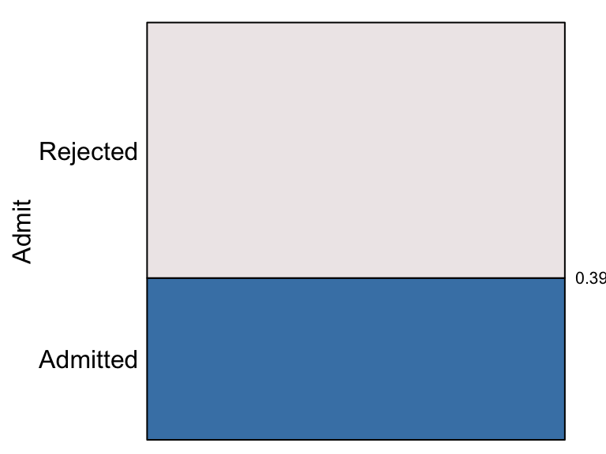

The proportion of applications admitted to these graduate programs at
Berkeley in 1973 was 0.39. The probability of an application being
admitted is represented by the area (or height) of the bottom (blue)
rectangle and the probability of rejection by the area (or height) of
the top (grey) rectangle which is 1 - 0.39 = 0.61.

The first argument to
[`eikos()`](https://rwoldford.github.io/eikosograms/reference/eikos.md)
is the `y` or “response” variate and determines the positions on the
vertical axis. There will be as many horizontal rectangles stacked up
the vertical axis as there are distinct values for `y`. For example, the
probability that any application is submitted to each of the six
graduate departments is

``` r
eikos("Dept", data = UCBAdmissions)
```

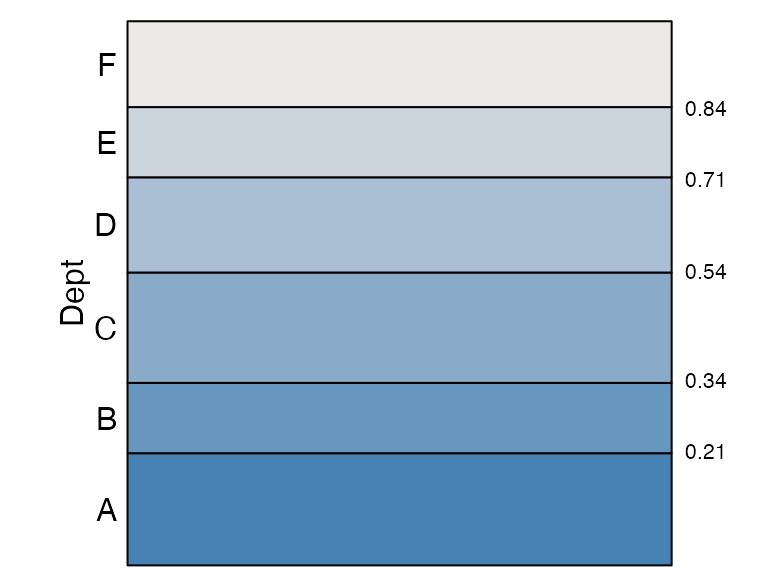

Again, areas correspond to probabilities and can be determined in this
case from each rectangle’s height (since widths are all 1). The
probability that a randomly selected application was submitted to
Department `A` is 0.21, to `B` is 0.13 (= 0.34 - 0.21), to `C` is 0.20
(= 0.54 - 0.34), to `D` is 0.17 (= 0.71 - 0.54), to `E` is 0.13 (=
0.84 - 0.71), and finally to `F` is 0.16 (= 1 - 0.84).

## Conditional and marginal probabilites

The eikosogram reinforces the basic probability rule that when the
values of the variate are mutually exclusive and exhaust the set of
possibilities, the probabilities must sum to one:
``` math
Pr(Dept = A) + Pr(Dept = B) + \cdots + Pr(Dept = F) = 1 
```
Note that this was because not all Berkeley departments are being
considered here; these probabilities are therefore *conditional* on the
fact that the department is one of the six largest.

In a very direct sense, the unit square of the eikosogram *frames* the
probabilities expressed within it and these are **always conditional on
whatever background information determines the unit square**.

For example, in addition to considering only the six largest
departments, we could also restrict consideration by sex. The number of
applications from each gender is

``` r
eikos("Gender", data = UCBAdmissions)
```

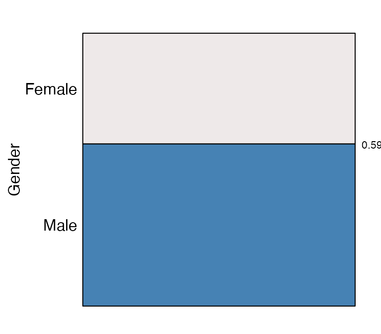

showing that there are unequal numbers of applications from each sex
with $`Pr(Gender = Male) = 0.59`$ and $`Pr(Gender = Female) = 0.41`$.

The eikosogram conditional only on “Male” applicants is

``` r
eikos("Dept", data = UCBAdmissions[,"Male",], 
      main = "Applications from males")
```

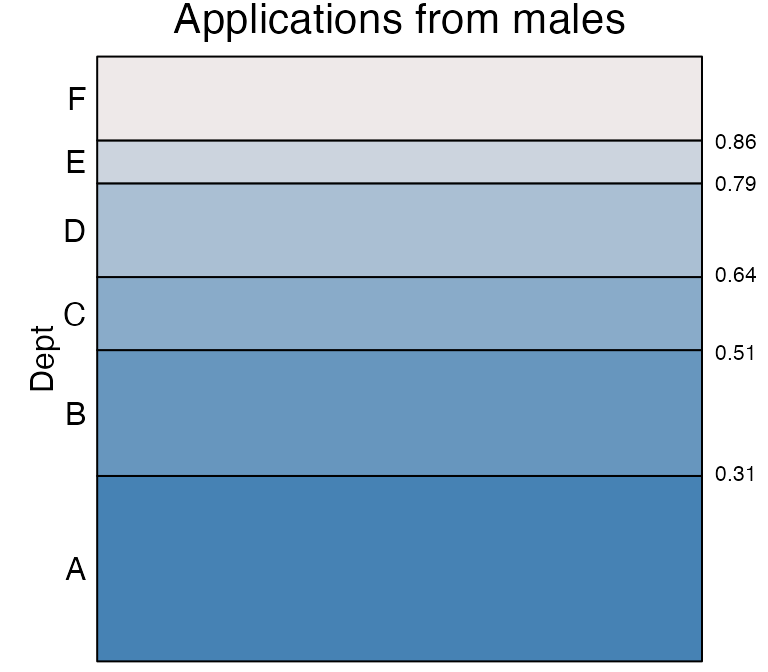

Probabilities can be determined as before but we can see immediately
from the eikosogram that departments `A` and `B` are the most popular
departments for male applicants, more so than for all applications
combined (in the previous eikosogram).

Conditioning on the “Female” applications

``` r
eikos("Dept", data = UCBAdmissions[,"Female",], 
      main = "Applications from females")
```

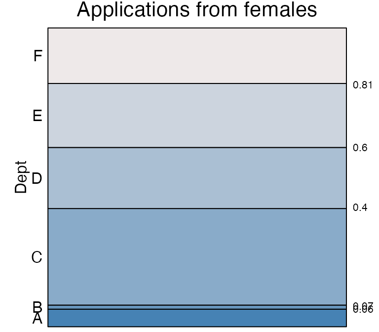

we see a rather different distribution of probabilities. Departments `A`
and `B` are much less popular with female applicants than with male
(e.g. only 1 in 100 applications from females are to `B` compared to 1
in 5 for males). Instead departments `C` and `E` are much more likely to
receive an application if it is from a female than if it is from a male.

Knowing the marginal probabilities that an application is from a female
or a male, we might put these two eikosograms together in a single
eikosogram.

``` r
eikos(y = "Dept", x = "Gender",  data = UCBAdmissions,
      xprobs_size = 8, yprobs_size = 8)
```

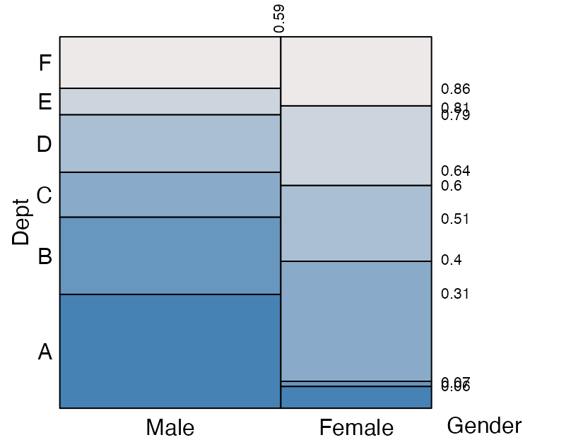

As can be seen the two conditional eikosograms are now fitted into the
unit square, the width of each being the marginal probability of that
conditioning variable “Gender”.

The conditioning variate(s) values appear across the bottom horizontal
axis and the response along the left hand vertical axis. This
arrangement makes reading the conditional probabilities follow visually
left to right, top to bottom. For example,
$`Pr(Dept = A ~\vert~Gender = Male) = 0.31)`$ visually follows the
display left to right and dropping down to the bottom edge for the value
of the conditioning variate(s).

*Numerical values along the top* horizontal edge are the *cumulative
marginal probabilities* associated with the values of the (bottom)
conditioning variate. For example - the probability that an application
is from a male applicant is $`0.59`$ and - the probability that an
application is from a female applicant is the difference
$`1 - 0.59 = 0.41`$.

*Numerical values along the right* vertical edge are the *cumulative
conditional probabilities* for each department’s applications given
gender.

- For every horizontal line in the plot, the *cumulative conditional
  probability* to that height is given.

- The height of each rectangle corresponds to the **conditional
  probability** of an application to that department given the
  corresponding gender. For example,

  - $`Pr(Dept = E ~\vert~Gender = Male) = 0.86 - 0.79 = 0.07`$
  - $`Pr(Dept = E ~\vert~Gender = Female) =  0.81 - 0.6 = 0.21`$
  - $`Pr(Dept = A ~\vert~Gender = Male) = 0.31`$
  - $`Pr(Dept \in \left\{B, D \right\} ~\vert~Gender = Male) = (0.51 - 0.31) + (0.79 - 0.64) = 0.35`$

- The area of each rectangle corresponds to the **joint probability** of
  an application to that department from the corresponding gender. For
  example,

  - $`Pr(Dept = E, Gender = Male) = 0.59 \times (0.86 - 0.79) = 0.0413`$

### geometry and probability

In its construction, the eikosogram

- divides the unit square into
  - vertical bars with widths equalling the probabilities for each value
    of the conditioning variate(s),
  - and then divides each vertical bar horizontally into
    - rectangles with heights equal to the conditional probabilities of
      each value of the response variate given the value(s) of the
      conditioning variate(s).

The area of every rectangle now equals the joint probability of the
corresponding values of the conditioning and response variates.

The power of the eikosogram is that its **geometry embeds the
probabilities** of discrete random variates:

- the vertical axis shows the values of the **response** variate

- the horizontal axis shows the values of the **explanatory** or
  **conditioning** variate(s)

- each axis rangee exactly from 0 to 1

- total probability is 1, the area of the whole eikosogram

- **widths** of rectangles are **marginal probabilities**

- **heights** of rectangles are **conditional probabilities**

- **areas** of rectangles are **joint probabilities**

  ``` math
  joint = area = height \times width = conditional \times marginal
  ```

- the width of an entire vertical bar is the area of that bar (since its
  height is 1) and is also the sum of the areas of the rectangles it
  contains

- the width of an entire vertical bar is the therefore the marginal
  probability for that value of the (horizontal) conditioning variate

By construction, probability comparisons are easily made visually with
an eikosogram.

## Marginal probabilities for the response

An eikosogram displays the joint probability of two (or more)
categorical variates by area of rectangles. From this it is easy to
determine the marginal probability of any value of the conditioning
variate (width) but not the marginal probability of the response
variate. This is because the heights record the conditional **not** the
marginal probabilities of the response variate value given that of the
conditioning variate.

The marginal for the response value is found by summing the areas of the
rectangles having the same colour (i.e. those which correspond to the
same response value).

This summing of areas is called **marginalization** and corresponds to a
rule of probability. For example,
``` math
Pr(Dept = A) = \sum_{gender \in \left\{Male, Female\right\}} Pr(Dept = A, Gender = gender)
```
with
``` math
Pr(Dept = dept, Gender = gender) = Pr(Dept = dept ~\vert~Gender = gender) \times Pr(Gender = gender) 
```
for all values of $`dept`$ and $`gender`$.

Marginalization can sometimes seems mysterious when first encountered.
Fortunately, the eikosogram lends itself to another visual metaphor that
simplifies the idea of marginalization. This is the **water container
metaphor**.

### the water container metaphor

Consider again the joint probability distribution of $`Dept`$ and
$`Gender`$ given by the eikosogram

``` r
eikos(y = "Dept", x = "Gender", data = UCBAdmissions, 
      xlabs = FALSE, yaxs = FALSE, xaxs = FALSE)
```

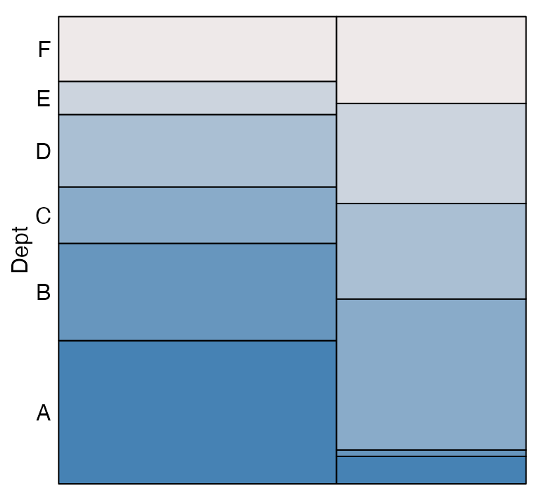 Only
the department labels are shown and we now imagine that the picture
shows two containers beside one another, each containing liquids of
differing density so that the denser liquid, being heavier (and here
darker in colour), sinks to the bottom in each container. Each density
of liquid (colour of rectangle) corresponds to a department and each
container a gender (male on left, female on right).

Marginalization is simply removing the distinction between the two
genders; or equivalently removing the barrier which separates the two
containers. If these were liquids, then removing the barrier (or
perforating the barrier) would cause the liquids to mix and then settle
again according to density. The corresponding (now single combined)
container would look like

``` r
eikos("Dept", data = UCBAdmissions, 
      xlabs = FALSE, yaxs = FALSE, xaxs = FALSE)
```

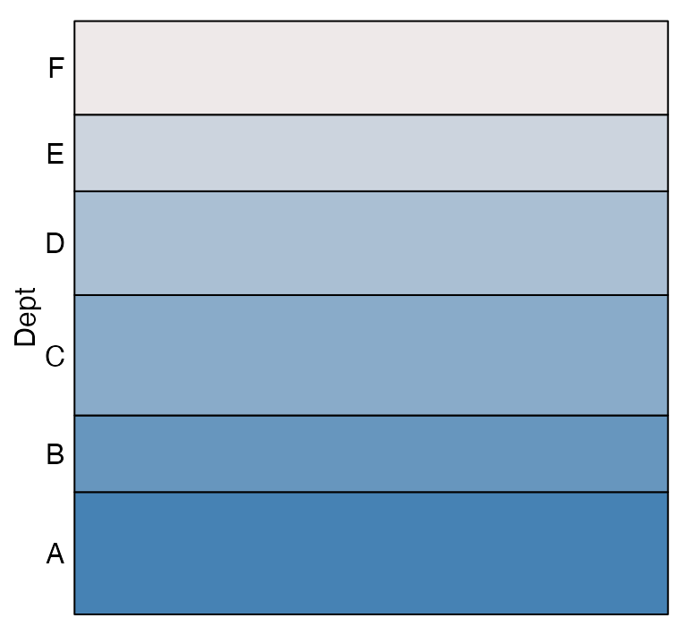

Just as the volume of each liquid must be conserved, so too must the
area of each colour, and so the total probability for each department.

Marginalization can be thought of as perforating the barrier separating
two volumes of liquid.

## Bayes’s theorem

The eikosogram gives the joint probability of the response and
conditioning variates. It highlights the marginal probabilities of the
conditioning variate but not of the response variate, whose
probabilities appear only as conditional. The appearance of the
eikosogram, and hence the joint distribution, can be different depending
on which variates are the response and which are conditioned upon.

For example, consider again the probability of admission to Berkeley
graduate school, but this time condition on the sex of the applicant.

``` r
eikos(y = "Admit", x = "Gender", data = UCBAdmissions)
```

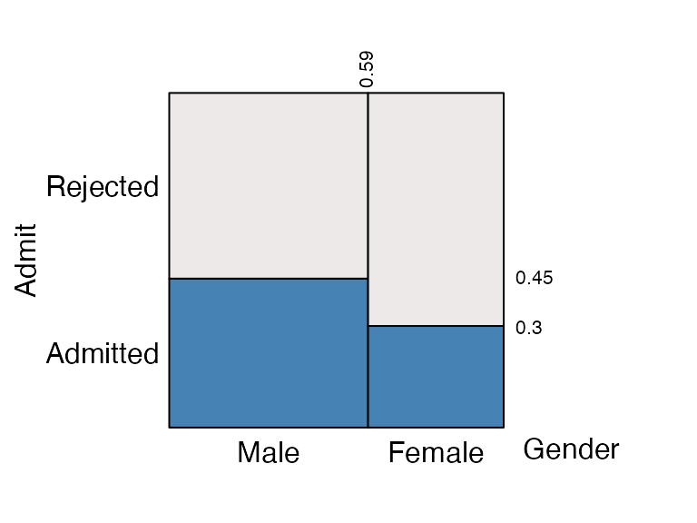

For all applications, this shows the joint distribution of the variates
`Admit` and `Gender`. As can be seen, the probability of admission for
male applicants is 0.45 and greater than that for female applicants
(0.3). The probability that an application is from a male is 0.59 and
from a female 0.41 = 1 - 0.59.

The joint probability that an application is from a male and that it
results in an offer of admission is the area of the bottom left
rectangle or

\$\$ \begin{array}{rcl} Pr(Gender = \mbox{"Male"} \~~\\ \~~Admit =
\mbox{"Admitted"}) &=& \mbox{area of bottom left rectangle} \\ &=&
\mbox(height) \times \mbox{(width) of rectangle} \\ &=& Pr(Admit =
\mbox{"Admitted"} ~\vert~Gender = \mbox{"Male"})\\ &&
\~\~\~\~\~\~\~\~\~~\times Pr(Gender = \mbox{"Male"} )\\ &=& 0.45 \times
0.59 \\ &=& 0.2655 \end{array} \$\$ Similarly, the area of the bottom
right rectangle is
``` math

\begin{array}{rcl}
Pr(Gender = \mbox{"Female"} ~~\& ~~Admit = \mbox{"Admitted"}) &=& Pr(Admit = \mbox{"Admitted"} ~\vert~Gender = \mbox{"Female"}) \\
 && ~~~~~~~~~~\times 
Pr(Gender = \mbox{"Female"} ) \\
& = & 0.3 \times 0.41 \\
&=& 0.123
\end{array}
```
the area of the top left rectangle is
``` math

\begin{array}{rcl}
Pr(Gender = \mbox{"Male"} ~~\& ~~Admit = \mbox{"Rejected"}) &=& Pr(Admit = \mbox{"Rejected"} ~\vert~Gender = \mbox{"Male"}) \\
 && ~~~~~~~~~~\times 
Pr(Gender = \mbox{"Male"} ) \\
& = & (1 - 0.45) \times 0.59 \\
&=& 0.3245
\end{array}
```
and finally the area of the top right rectangle is
``` math

\begin{array}{rcl}
Pr(Gender = \mbox{"Female"} ~~\& ~~Admit = \mbox{"Rejected"}) &=& Pr(Admit = \mbox{"Rejected"} ~\vert~Gender = \mbox{"Female"}) \\
 && ~~~~~~~~~~\times 
Pr(Gender = \mbox{"Female"} ) \\
& = & (1 - 0.3) \times (1 - 0.59) \\
&=& 0.287
\end{array}
```
The sum of these four probabilities is of course 1.

Alternatively, the joint distribution of the variates `Admit` and
`Gender` could be expressed by conditioning on the values or `Admit`
rather than on those of `Gender`:

``` r
eikos(y = "Gender", x = "Admit", data = UCBAdmissions)
```

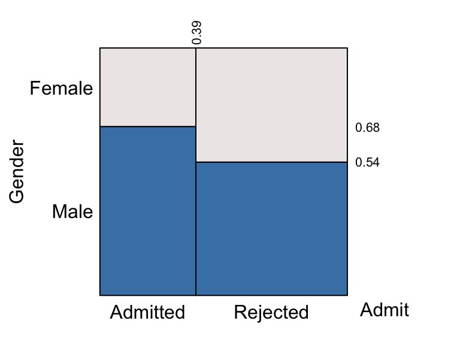

Now we see that the conditional probability that the the gender of the
applicant was male given the application was admitted is 0.68. Given the
application was rejected, the probability that the gender was male was
only 0.54. The other two conditional probabilities, of the applicant
being female, given the application was admitted or rejected is 0.32 amd
0.46 respectively.

These two eikosograms **show the same joint distribution** and the four
rectangles in each **show the same joint probabilities**. That is the
bottom left rectangle of both eikosograms have the same variate values,
namely the `Gender` = “Male” and `Admit` = “Admitted”. They must
therefore have the same area. In the first eikosogram, this area was
``` math
 
Pr(Admit = \mbox{"Admitted"} ~\vert~Gender = \mbox{"Male"}) \times Pr(Gender = \mbox{"Male"} )
```
which is just \$Pr(Admit = _(&) Gender = ). The same joint probability
in the second eikosogram is the area of the corresponding rectangle
``` math
 
Pr(Gender = \mbox{"Male"} ~\vert~Admit = \mbox{"Admitted"}) \times Pr(Admit = \mbox{"Admitted"}).
```
That these two rectangles have the same area is the famous result due to
the Thomas Bayes! Namely that
``` math
 
\begin{array}{rcl}
Pr(Admit = \mbox{"Admitted"} ~\vert~Gender = \mbox{"Male"}) &\times&  Pr(Gender = \mbox{"Male"} )\\
= ~~
Pr(Gender = \mbox{"Male"} ~\vert~Admit = \mbox{"Admitted"}) &\times& Pr(Admit = \mbox{"Admitted"}).
\end{array}
```
Rectangles which identify the *same* joint probability in both
eikosograms must have the same area. This is Bayes’s theorem and is
perhaps most simply expressed generically as
``` math
Pr(Y ~\vert~X) \times Pr(X) = Pr(X ~\&~ Y) = Pr(X ~\vert~Y) \times Pr(Y). 
```
Simply, areas of corresponding rectangles must match.

## Independence

Two random variates $`X`$ and $`Y`$ are said to be distributed
**independently** of one another if their corresponding eikosgram is
**flat**.

For example, consider the following eikosogram

``` r
indep <- as.table(array(c(10, 40, 15, 60),
                        dim = c(2,2),
                        dimnames = 
                        list(X =c("x_1", "x_2"), 
                             Y = c("y_1", "y_2"))))
eikos("Y", "X", data = indep)
```


Independence of variates X and Y

Clearly, for $`i = 1, 2`$
``` math
Pr(Y = y_i ~\vert~X = x_1) = Pr(Y = y_i ~\vert~X = x_2) = Pr(Y = y_i)
```
This is what we mean by independence - whatever the value of $`X`$ the
probability that $`Y`$ takes any particular value is the same. $`Y`$’s
values are independent of those of $`X`$.

By definition, this presents itself as all regions being flat across the
values of the conditioning variate.

Of course, if we reverse the conditioning, flatness in the eikosogram
must happen because of the independence. And this is what we see:

``` r
eikos("X", "Y", data = indep)
```


Independence of variates X and Y

Now, for $`i = 1, 2`$
``` math
Pr(X = x_i ~\vert~Y = y_1) = Pr(X = x_i ~\vert~Y = y_2) = Pr(X = x_i).
```

It follows from either of these, and the definition that a joint
probability is the area of the corresponding rectangle, that
independence occurs if and only if for any $`i`$, $`j`$,
``` math
Pr(X = x_i ~\&~  Y = y_j) = Pr(X = x_i) \times Pr(Y = y_j).
```

For a deeper exploration of independence relationships between
categorical variates, see the vignette
[IndependenceExploration](https://rwoldford.github.io/eikosograms/articles/IndependenceExploration.md).

## Events

Consider the possibility of two events, $`A`$ and $`B`$, each of which
either occurs or does not occur. Events simply modelled as binary
variates taking values `Yes` or `No` depending on whether the
corresponding event occurs or not.

As seen above, independence of two events occurs if and only all
corresponding eikosograms are flat (see the vignette
[IndependenceExploration](https://rwoldford.github.io/eikosograms/articles/IndependenceExploration.md)
for more detail).

As with independence, a number of other fundamental reletionships
between events uniquely present as eikosograms. This makes them both
easily detected from the visualization and easily understood interpreted
from the eikosogram. The concepts become clearly distinguished from one
another (as opposed to Venn diagrams, see Cherry and Oldford (2003))

### Coincident and complementary events

The visual hallmark of the eikosogram of a pair of events which are
coincident, or of a pair which are complementary, is that the
conditioning rectangles are all of one colour and are different from one
another.

**Coincident events** If $`A`$ and $`B`$ are coincident events then the
eikosograms of their values (`Yes` for occurs; `No` for does not occur)
has the form:

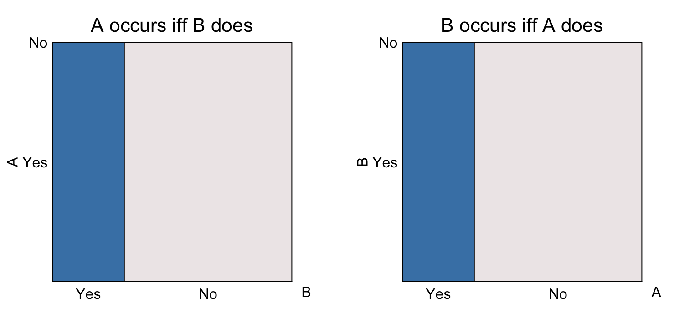

In the left most eikosogram, if event $`B`$ occurs then $`A`$ must occur
(probability is 1); if the event $`B`$ does not occur, then $`A`$ cannot
occur (probability is 0). The same information appears in the right hand
eikosogram where $`A`$ is now the conditioning event.

**Complementary events** If $`A`$ and $`B`$ are complementary events
then the eikosograms of their values (`Yes` for occurs; `No` for does
not occur) has the form:

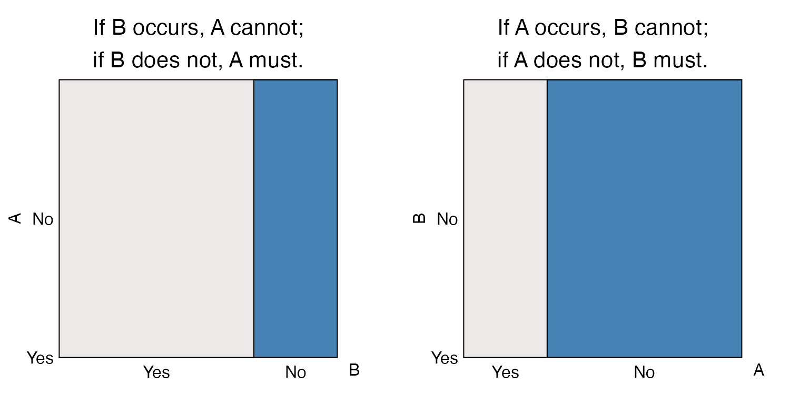

In the left most eikosogram, if event $`B`$ occurs then $`A`$ cannot
occur (probability is 0); if the event $`B`$ does not occur, then $`A`$
must occur (probability is 1). The same information appears in the right
hand eikosogram where $`A`$ is now the conditioning event.

### Mutually exclusive events

Complementary events are a special case of mutually exclusive events. If
$`A`$ and $`B`$ are complementary, then one of them must occur (in which
case the other will not). $`A`$ and $`B`$ are **mutually exclusive**
events, then if one occurs the other cannot however neither *must*
occur. The eikosograms will look have the following form:

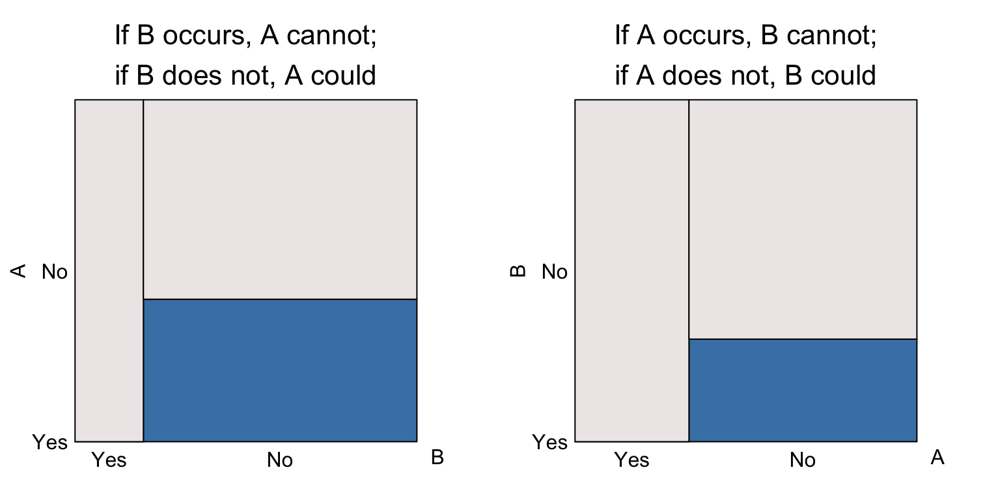

In the left most eikosogram, if event $`B`$ occurs then $`A`$ cannot
occur (probability is 0); if the event $`B`$ does not occur, then $`A`$
may or may not occur (probability is greater than 0). The same
information appears in the right hand eikosogram where $`A`$ is now the
conditioning event.

Mutually exclusive events only have some non-zero probability for the
response event (vertical axis) occurring when the conditioning event
does not. If that non-zero probability is also 1, then the events are
complementary as well.

### Positive and negative association

Between coincident and complementary events, we also remark on whether
events tend to occur to gether or tend to not occur together. When
events tend to occur together we say that they are **positively
associated**; when they tend to not occur together we say that they are
**negatively associated**.

**Positive association** If $`A`$ and $`B`$ are positively associated,
their eikosograms will have the following form

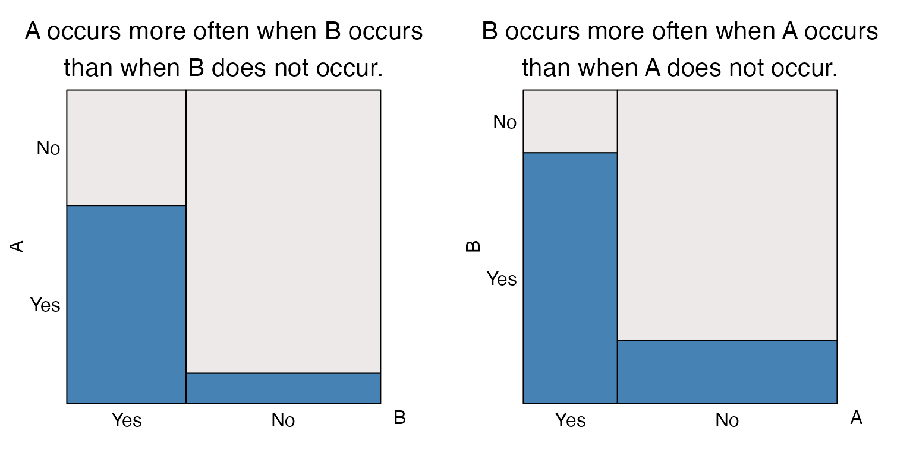

The visual hallmark is that the leftmost bar is higher than the
rightmost. In the left eikosogram, this means that
``` math
Pr(A  \text{ occurs} ~\vert~B \text{ occurs}) > Pr(A  \text{ occurs} ~\vert~B \text{ does not occur}).
```
On the right eikosogram, we have the same for the other conditional
probabilities, namely that
``` math
Pr(B  \text{ occurs} ~\vert~A \text{ occurs}) > Pr(B  \text{ occurs} ~\vert~A \text{ does not occur}).
```

*Clearly, coincident events are an especially strong case of positively
associated events.*

**Negative association** If $`A`$ and $`B`$ are negatively associated,
their eikosograms will have the following form

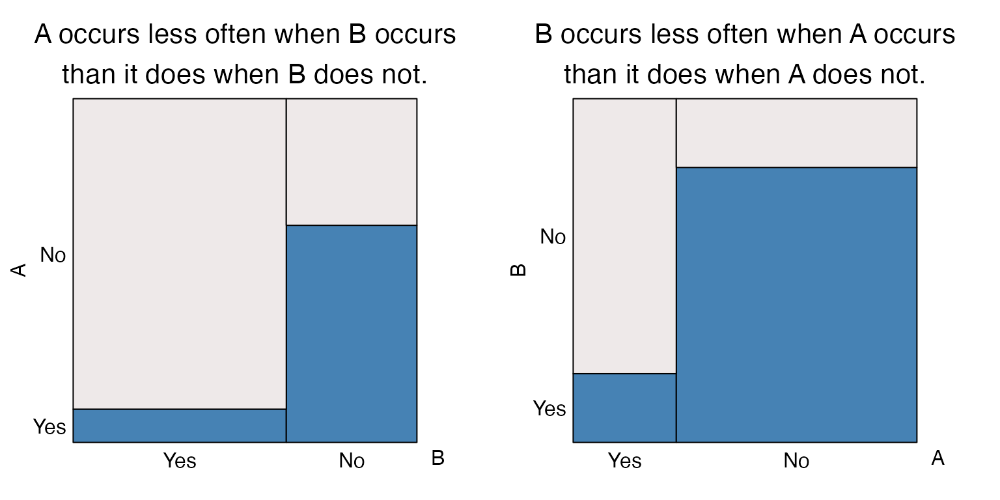

The visual hallmark is that the leftmost bar is lower than the
rightmost. In the left eikosogram, this means that
``` math
Pr(A  \text{ occurs} ~\vert~B \text{ occurs}) < Pr(A  \text{ occurs} ~\vert~B \text{ does not occur}).
```
On the right eikosogram, we have the same for the other conditional
probabilities, namely that
``` math
Pr(B  \text{ occurs} ~\vert~A \text{ occurs}) < Pr(B  \text{ occurs} ~\vert~A \text{ does not occur}).
```

*Clearly, complementary events are an especially strong case of
negatively associated events.*

### An association spectrum

As the previous sections have shown, there is a range of associations
that can be seen using eikosograms:

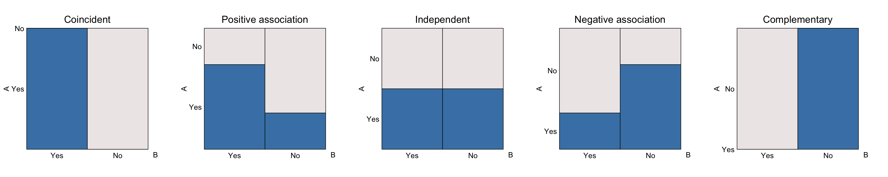

Here, the proportions have been arranged so that the total area of the
bottom colour (i.e. blue) is the same across all five eikosograms.
Similarly, the width of all columns are unchanged across the
eikosograms. This has the effect that the marginal probabilities of the
eventa are the same across all eikosograms.

The only differences between the eikosograms is in the association
between the events. Applying the **water container metaphor**, it is
only the distribution of the water between the two containers that has
changed. Were the barrier between containers removed (or perforated so
that the water can flow to an equilibrium), all resulting eikosograms
would match that of the middle one (independence but without the
vertical barrier). This reflects that the marginal probability of the
event $`A`$ occurring, or not, is identical in all five cases.

## Conditional Independence

When there are more than two variates (or events) we can see conditional
independence of any pair given the values for the other variate(s).  
The key is to look for flat regions in the eikosogram where some
conditioning variate(s) values match.

For example, consider the following eikosograms for the joint
distribution of $`X`$, $`Y`$, and $`Z`$, where each variate in turn
appears on the vertical axiz as the response:

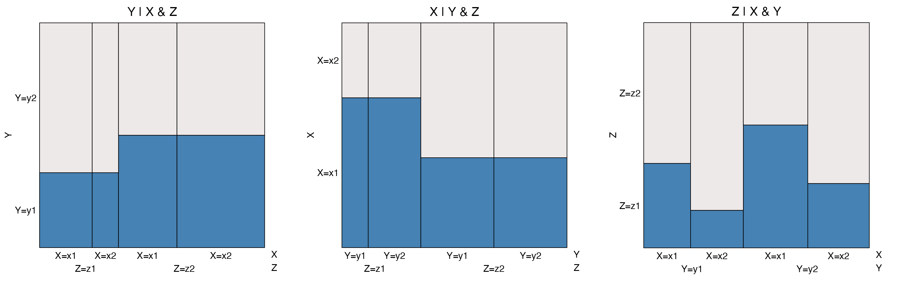

For the leftmost eikosogram, two flat regions appear. One occurs when
$`Z = z1`$ as $`X`$ changes from $`x1`$ to $`x2`$. This flat region says
that given $`Z = z1`$, $`Y`$ and $`X`$ are independently distributed.
The second flat region occurs when $`Z = z2`$ and again for all values
of $`X \in \{x1, x2 \}`$. This implies that $`Y`$ and $`X`$ are also
independently distributed when $`Z = z2`$. When conditional independence
between $`Y`$ and $`X`$ occurs for all values of the conditioning
variate $`Z`$, as it does here, we say that $`Y`$ and $`X`$ are
**conditionally independent** given $`Z`$.

This conditional independence makes it easy to see the conditional
distribution of $`Y`$ for each value of $`Z`$. Applying the **water
container metaphor**, this time removing the barriers between each value
of $`X`$ but preserving the barrier between the values of $`Z`$, we see
the joint distribution of $`Y`$ and $`Z`$ after marginalizing over
$`X`$. With these barriers erased, the leftmost eikosogram shows a
negative association between $`Y`$ and $`Z`$**unconditionally** on
$`X`$.

The middle eikosogram tells the same story, this time with $`X`$ as the
response variate. Again, the two flat regions demonstrate that $`X`$ and
$`Y`$ are conditionally independent given $`Z`$. Applying the **water
container metaphor** as before, now reveals the joint distribution of
$`X`$ and $`Z`$ after marginalizing over $`Y`$. This reveals a posiitive
association between $`X`$ and $`Z`$ unconditionally on $`Y`$.

In the rightmost eikosogram, no flats appear and hence no conditional
independencies exist. That is $`Z`$ is neither conditionally independent
of $`X`$ given $`Y`$ nor conditionally independent of $`Y`$ given $`X`$.
Rather, in the rightmost eikosogram we can see that conditional on $`Y`$
(for each of its values) $`Z`$ and $`X`$ are positively associated, and
that conditional on $`X`$ (for each of its values; note that the $`X`$
values are not grouped) $`Z`$ and $`Y`$ are negarively associated.

For more investigation of conditional independence among three variates
see the vignette
[IndependenceExploration](https://rwoldford.github.io/eikosograms/articles/IndependenceExploration.md).

## Problems, puzzles, and paradoxes

Oldford (2003) contains a number of problems, puzzles, and paradoxes
that are solved/explained via eikosograms. Many are classic problems,
some are variations on these, and some are new. These include

- witness statement of a crime and the probability of guilt; the green
  cab blue cab problem from Tversky and Kahneman (1982)
- the gas station problem (a simplified version of the classic
  “secretary problem”)
- the “Cherry pie” paradox plus a new twist on it (this is a preference
  paradox involving ordering)
- a twice reversing Simpson’s paradox (artificially constructed)
- the two envelope problem
- the Monty Hall problem; and a new variation
- the prisoner’s dilemma (or three prisoner problem); and a new
  variation

## References

Cherry, W. H., and R. W. Oldford. 2003. “Picturing Probability: The
Poverty of Venn Diagrams, the Richness of Eikosograms.”
<https://math.uwaterloo.ca/~rwoldfor/papers/eikosograms/paper.pdf>.

Oldford, R. W. 2003. “Probability, Problems, and Paradoxes Pictured by
Eikosograms.”
<https://math.uwaterloo.ca/~rwoldfor/papers/eikosograms/examples/paper.pdf>.

Tversky, A., and D. Kahneman. 1982. “Evidential Impact of Base Rates.”
In *Judgement Under Uncertainty: Heuristics and Biases*, edited by D.
Kahneman P. Slovic and A. Tversky, 153–60. Cambridge, U.K.: Cambridge
University Press.
